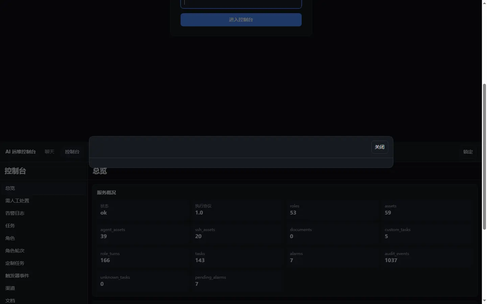
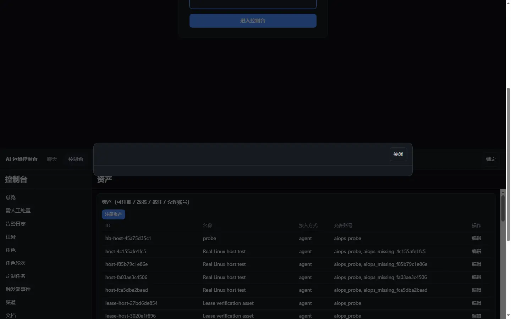
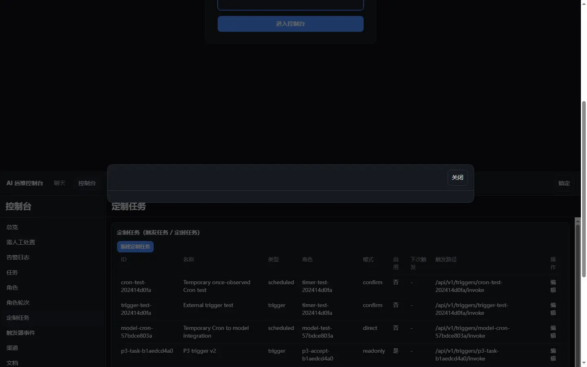

# P3 真机演示与验收报告

日期：2026-10-03
环境：测试服务器 172.236.254.94（Ubuntu 24.04 x86_64，Docker + Compose）
镜像：`ghcr.io/hewenze11/ai-ops@sha256:3d89fea7…`（构建自提交 `82515d0`）
服务监听：`127.0.0.1:18765`（仅回环，不对公网暴露）
证据脚本：`scripts/p3_acceptance.py`
证据报告：测试机 `integration/p3-acceptance-report.json`

---

## 一、结论

P3（Web 控制台 + 消息渠道第一层 + 管理写入面）在**真实环境**端到端验证，
**12 项检查全部通过**。本报告只陈述实际观察到的事实，不把"已保存"说成"已发送"，
不把"单元测试通过"当作"真机可用"。

---

## 二、验证方式

不是跑单元测试，而是**部署真机后，用控制台实际调用的那批 HTTP 路由**逐项验证。
每项检查记录它观察到的原始证据（状态码、返回字段），全部落在报告文件里。

用途边界：本产品是**通用 AI 运维产品的可运行预览**，当前定位是"执行底座 + 控制面"，
不是成品。以下每项都注明"已验证"与"未宣称"的界线。

---

## 三、12 项检查

| # | 检查 | 结果 | 观察到的证据 |
| --- | --- | --- | --- |
| 1 | 控制台创建角色 | ✅ | 返回 `{id, name}`，**不含任何凭据** |
| 2 | 重名角色被拒 | ✅ | HTTP **409** |
| 3 | 角色改名生效 | ✅ | 列表中出现新名字 |
| 4 | 注册 agent 资产一次性返回 token | ✅ | `agent_token` 存在 |
| 5 | **该 token 不出现在任何 GET** | ✅ | 59 个资产的列表里搜不到该 token |
| 6 | SSH 资产缺主机公钥被拒 | ✅ | HTTP **422**（fail-closed） |
| 7 | 定制任务创建返回触发令牌 | ✅ | `trigger_token` + `trigger_path` |
| 8 | **编辑定制任务不返回令牌** | ✅ | `token_unchanged: true` |
| 9 | 编辑后触发路径仍能触发 | ✅ | HTTP **202** |
| 10 | **未配对来信不产生轮次** | ✅ | `status=unpaired`，该角色轮次数 = 0 |
| 11 | 未配对来信不产生轮次（配对后） | ✅ | 配对后同一渠道用户 → `queued`，轮次数 = 1 |
| 12 | outbox 按身份隔离 | ✅ | 返回 `{messages, cursor}` 结构 |

> 第 5、8、10 项是**安全性质**：一次性凭据只出示一次、编辑不泄漏令牌、
> 陌生人发消息进不了运维面。这三条我用测试钉住了，不是口头承诺。

---

## 四、控制台真机界面

以下为通过 SSH 隧道把控制台拉到本地浏览器拍摄的**真实页面截图**（非设计稿）：

### 4.1 控制台总览



- 左侧 **15 个页签全部可用**：总览 / 需人工处置 / 告警日志 / 任务 / **角色** /
  角色轮次 / **定制任务** / 触发器事件 / **渠道** / 文档 / **资产** / **Skills** /
  记忆 / 审计 / 输出。
- 服务概况显示的是这些天真实测试攒下的数据：
  `roles=53`、`assets=59`（agent 39 / ssh 20）、`role_turns=166`、`tasks=143`、
  `audit_events=1037`。
- 页面有一块 **"当前缺口（如实呈现，不假装完成）"**——控制台刻意标出哪些还没做完，
  避免界面看起来比实际更完整。

### 4.2 资产页（新增写入面）



- 顶部有 **「注册资产」** 按钮（本次 P3 新增）。
- 表格列出资产：ID / 名称 / 接入方式 / 允许账号 / 操作；每行可「编辑」。
- **接入方式与凭据在这里不可改**——token 轮换、SSH 密钥仍走管理员接口。
  这是刻意的：凭据变更不该是浏览器里随手可点的操作。

### 4.3 定制任务页（新增写入面）



- 顶部有 **「新建定制任务」** 按钮。
- 表格列：ID / 名称 / 类型 / 角色 / 模式 / 启用 / 下次触发 / 触发路径 / 操作。
- 创建时一次性显示触发令牌；**编辑时不重新显示**。

---

## 五、已验证 vs 未宣称（诚实边界）

**已验证（真机）：**
- 控制台 15 个页签全部可打开并加载真实数据。
- 创建/改名角色、注册资产、创建/编辑定制任务、文档与 Skills 编辑。
- 一次性凭据（agent_token、trigger_token）只在创建时出示。
- SSH 资产必须预置主机公钥，否则拒绝。
- 渠道未配对来信不执行；配对后共用同一角色的记忆与串行队列。

**未宣称（本仓不内置，或需外部配合）：**
- 飞书/企业微信/微信的**真实出站发送与平台签名校验**：属部署侧。出站消息以
  投递形式**保存**，由外部渠道桥接拉取——我们**不会把"已存储"说成"已发送"**。
- 无多用户/权限分级：控制台是**单管理员凭据**的运维面。
- 文档/Skill 无并发编辑冲突检测（后写覆盖，有修订号可对比）。
- 商城本期不实现，仅预留对接边界。

---

## 六、如何复现

```bash
# 1. 部署指定提交的镜像
python scratch/ai-ops-development/deploy_sha.py 82515d0

# 2. 在测试机上跑验收（读取 secrets/admin_token，不打印凭据）
scp scripts/p3_acceptance.py root@<host>:/tmp/
ssh root@<host> python3 /tmp/p3_acceptance.py   # 输出 12 项 JSON

# 3. 看控制台（仅回环，需本地建 SSH 隧道）
ssh -L 18765:127.0.0.1:18765 root@<host>
# 浏览器打开 http://127.0.0.1:18765/ ，粘贴管理员 Token
```

---

## 七、下一步

P3 软件部分收口。真正剩下的**只有一项属代码/部署**的工作：

1. **飞书/微信真实出站发送 + 平台签名校验**：属部署对接，需要平台应用凭据。

关于“告警诊断策略”：它**不是代码待办**。运维提示词是**用户自己的内容**——定制任务的
`prompt` 字段由用户编写，触发时作为普通角色轮次交给 AI 排查，与聊天/定时共用同一角色与队列。
产品的付费 Skills 库价值在于**帮用户把提示词写好**，而不是把策略写死在代码里。
